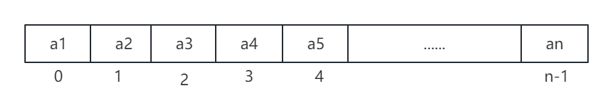

## 6.1、数组

数组是具有相同类型且长度固定的一组**数据项序列**，这组数据项序列对应存放在内存中的一块连续的区域中

数组存放的类型：1、整形	2、字符串	3、其它自定义类型

数组在使用前需先声明，声明时必须指定数组的大小且**数组大小之后不可再变**。



### 6.1.1	声明数组

```
var 数组变量名  [数组长度]元素类型
```

例如，声明数组student，长度为3，元素类型为string

```
var student [3]string
```

####  代码示例6.1.1

```
package main

import "fmt"

func main() {
	var student [3]string
	fmt.Println(student) 

}
```

####  代码示例6.1.1运行结果

```
[]
```

### 6.1.2	初始化数组

数组可以在声明时进行赋值，样例如下：

```
var student = [3]string{"lmgsanm", "test12", "hello"}
```

使用如方式初始化数组时，需保证大括号中的元素数量和数组大小一致

Go语言编译器在编译时也可根据元素的个数来设置数组的大小，通过用“...”代替数组大小来实现。样例如下：

```
var student = [...]string{"lmgsanm", "test12", "hello"}
```

####  代码示例6.1.2

```
package main

import "fmt"

func main() {
	var student = [...]string{"lmgsanm", "test12", "hello"}
	fmt.Println(student)
}
```

#### 代码示例6.1.2运行结果

```
[lmgsanm test12 hello]
```

### 6.1.3	range关键字

range是Go语言非常常用的一个关键字，主要作用是：配合for关键字对数组以及切片和映射等数据结构进行迭代

####  代码示例6.1.3

```
package main

import "fmt"

func main() {
	var student = [...]string{"lmgsanm", "test12", "hello"}
	for k, v := range student {
		fmt.Printf("key变量为:%v\t,value变量为：%v\n", k, v)
	}
}

```


####  代码示例6.1.3运行结果

```
key变量为:0	,value变量为：lmgsanm
key变量为:1	,value变量为：test12
key变量为:2	,value变量为：hello
```

range的表达式为range表达式。

在迭代时，关键字range会返回两个值，分别由变更key和value接收。其中key是当前循环迭代到的索引位置，v是该位置对应元素值的**一份副本**

range表达式及对应的返回值：

| range表达式 | 第一返回值 | 第二返回值 |
| ----------- | ---------- | ---------- |
| 数组        | 元素下标   | 元素值     |
| 切片        | 元素下标   | 元素值     |
| 映射        | 键         | 值         |
| 通道        | 元素       | N/A        |

### 6.1.4	遍历数组

####  代码示例6.1.4

```
package main

import "fmt"

func main() {
	var student = [...]string{"lmgsanm", "test12", "hello", "Tom"}
	for k, v := range student {
		fmt.Printf("数组下标为:%v,数组下标%v对应的值为%v\n", k, k, v)
	}
}

```


####  代码示例6.1.4运行结果

```
数组下标为:0,数组下标0对应的值为lmgsanm
数组下标为:1,数组下标1对应的值为test12
数组下标为:2,数组下标2对应的值为hello
数组下标为:3,数组下标3对应的值为Tom
```

