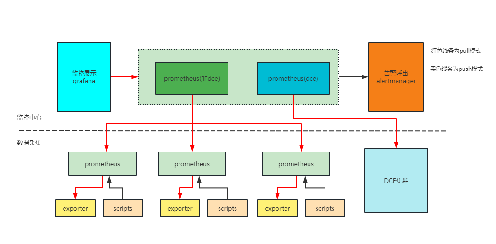
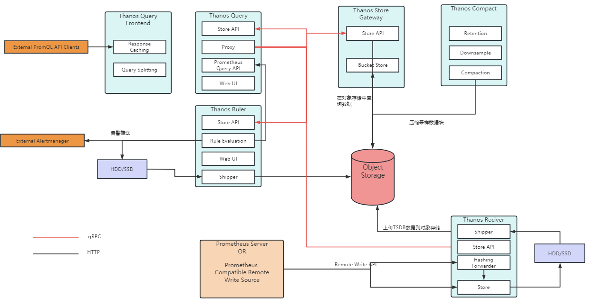
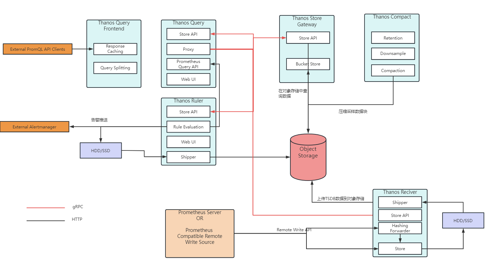

# 架构

## 原生架构


## 当前架构


# 组件

## 原生组件

1. prometheus:prometheus的核心组件，用于数据存储，聚合等
2. alertmanager：用于接收prometheus告警规则发出来的选区，并将告警信息通过alertmanager发送出去。可支持mail，wehook方式发送监控告警信息
3. pushgateway：用于推送自定义采集数据到prometheus

## 图形展示

1. grafana：用于自定义展示prometheus所存储的数据

## exporters

1. node_exporter：用于采集Linux服务器的OS监控数据
2. windows_exporter：用于采集Windows服务器的OS监控数据
3. blackbox_exporter：用于黑盒监控，即采集端口状态，进程状态，及URL拨测状态，包括SSL证书状态等

# 核心概念

## 数据模型

metric和labels

## 指标类型

### Counter

### Gauge

### Histogram

### Summary

## job和instance

# 数据查询

## 数据表达式类型

- **Instant vector**

- **Range vector**

- **Scalar**

- **String** 

## 字符串

## 浮点型

```
[-+]?(
      [0-9]*\.?[0-9]+([eE][-+]?[0-9]+)?
    | 0[xX][0-9a-fA-F]+
    | [nN][aA][nN]
    | [iI][nN][fF]
)
```

## 匹配表达式

```
=	等于
!=    不等于
=~   模糊匹配类型
!~    与XX内容不匹配
```


## 时间单位

```
ms：微秒
s：秒
m：分
h：时
d：天
w：周
y：年
```


## 数学运算符

```
+（加）
-（减）
*（乘）
/（除）
%（取余）
^（取反）
```


## 比较运算符

```
==
!=
>
<
>=
<=
```

## 逻辑运算符

```
and
or
unless
```

## 聚合运算符

```
sum（求和）
min（取最小值）
max（取最大值）
avg（取平均值）
group（分组聚合）
count（计算元素数量）
count_values（计算具备相同值的元素数量）
bottomk（查询排名最靠后的几个值）
topk（查询排名靠前的几个值）
```


# 函数

1. abs()
2. absent()
3. absent_over_time()
4. ceil()
5. changes()
6. clamp()
7. clamp_max()
8. clamp_min()
9. day_of_month()
10. day_of_week()
11. day_of_year()
12. days_in_month()
13. delta()
14. deriv()
15. **exp()**
16. **floor()**
17. histogram_count() and histogram_sum()
18. histogram_fraction()
19. histogram_quantile()
20. holt_winters()
21. hour()
22. idelta()
23. increase()
24. **irate()**
25. label_join()
26. label_replace()
27. ln()
28. log2()
29. log10()
30. minute()
31. month()
32. predict_linear()
33. **rate()**
34. resets()
35. round()
36. scalar()
37. sgn()
38. sort()
39. sort_desc()
40. sqrt()
41. time()
42. timestamp()
43. vector()
44. year()

# http API

## 状态返回码

- 400
- 200
- 422
- 503

## 数据返回

```
{
  "status": "success" | "error",
  "data": <data>,

  // Only set if status is "error". The data field may still hold
  // additional data.
  "errorType": "<string>",
  "error": "<string>",

  // Only if there were warnings while executing the request.
  // There will still be data in the data field.
  "warnings": ["<string>"]
}
```

## 查询实例

```
GET /api/v1/query
POST /api/v1/query
```

```
$ curl 'http://localhost:9090/api/v1/query?query=up&time=2015-07-01T20:10:51.781Z'
{
   "status" : "success",
   "data" : {
      "resultType" : "vector",
      "result" : [
         {
            "metric" : {
               "__name__" : "up",
               "job" : "prometheus",
               "instance" : "localhost:9090"
            },
            "value": [ 1435781451.781, "1" ]
         },
         {
            "metric" : {
               "__name__" : "up",
               "job" : "node",
               "instance" : "localhost:9100"
            },
            "value" : [ 1435781451.781, "0" ]
         }
      ]
   }
}
```

## 范围查询

```
GET /api/v1/query_range
POST /api/v1/query_range
```

```
$ curl 'http://localhost:9090/api/v1/query_range?query=up&start=2015-07-01T20:10:30.781Z&end=2015-07-01T20:11:00.781Z&step=15s'
{
   "status" : "success",
   "data" : {
      "resultType" : "matrix",
      "result" : [
         {
            "metric" : {
               "__name__" : "up",
               "job" : "prometheus",
               "instance" : "localhost:9090"
            },
            "values" : [
               [ 1435781430.781, "1" ],
               [ 1435781445.781, "1" ],
               [ 1435781460.781, "1" ]
            ]
         },
         {
            "metric" : {
               "__name__" : "up",
               "job" : "node",
               "instance" : "localhost:9091"
            },
            "values" : [
               [ 1435781430.781, "0" ],
               [ 1435781445.781, "0" ],
               [ 1435781460.781, "1" ]
            ]
         }
      ]
   }
}
```

## 其它接口

https://prometheus.io/docs/prometheus/latest/querying/api/

```
GET /api/v1/format_query
POST /api/v1/format_query
GET /api/v1/series
POST /api/v1/series
GET /api/v1/labels
POST /api/v1/labels
GET /api/v1/label/<label_name>/values
GET /api/v1/query_exemplars
POST /api/v1/query_exemplars
GET /api/v1/targets
GET /api/v1/rules
GET /api/v1/alerts
GET /api/v1/targets/metadata
GET /api/v1/metadata
GET /api/v1/alertmanagers
GET /api/v1/status/config
GET /api/v1/status/flags
```

# 集群架构

## 邦联模式



## thanos架构

### Sidecar模式



### Receive模式



企微模板

```
[root@prometheus-bpmdev alertmanager]# cat template/wechat.tmpl
{{ define "wechat.default.message" }}
{{- if gt (len .Alerts.Firing) 0 -}}
{{- range $index, $alert := .Alerts -}}
{{- if eq $index 0 }}
=========xxx环境监控报警 =========
告警状态：{{   .Status }}
告警级别：{{ .Labels.severity }}
告警类型：{{ $alert.Labels.alertname }}
故障主机: {{ $alert.Labels.instance }} {{ $alert.Labels.pod }}
告警主题: {{ $alert.Annotations.summary }}
告警详情: {{ $alert.Annotations.message }}{{ $alert.Annotations.description}};
触发阀值：{{ .Annotations.value }}
故障时间: {{ ($alert.StartsAt.Add 28800e9).Format "2006-01-02 15:04:05" }}
========= = end =  =========
{{- end }}
{{- end }}
{{- end }}
{{- if gt (len .Alerts.Resolved) 0 -}}
{{- range $index, $alert := .Alerts -}}
{{- if eq $index 0 }}
=========xxx环境异常恢复 =========
告警类型：{{ .Labels.alertname }}
告警状态：{{   .Status }}
告警主题: {{ $alert.Annotations.summary }}
告警详情: {{ $alert.Annotations.message }}{{ $alert.Annotations.description}};
故障时间: {{ ($alert.StartsAt.Add 28800e9).Format "2006-01-02 15:04:05" }}
恢复时间: {{ ($alert.EndsAt.Add 28800e9).Format "2006-01-02 15:04:05" }}
{{- if gt (len $alert.Labels.instance) 0 }}
实例信息: {{ $alert.Labels.instance }}
{{- end }}
========= = end =  =========
{{- end }}
{{- end }}
{{- end }}
{{- end }}
```

