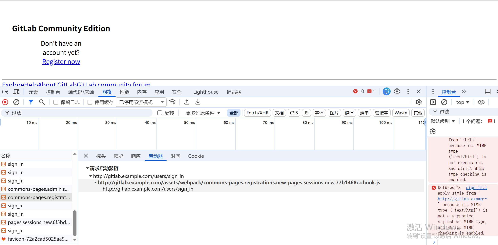
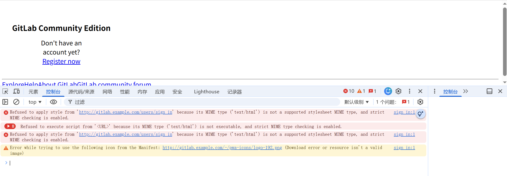

Sanm_2026

# 服务器

kube-master	43.112.79.213	172.23.171.173

kube-node 	43.112.67.159	172.23.171.172


```
kubeadm init \
  --apiserver-advertise-address=172.23.171.173 \
  --kubernetes-version v1.29.15 \
  --service-cidr=10.96.0.0/12 \
  --pod-network-cidr=192.168.0.0/16 \
  --cri-socket unix:///var/run/cri-dockerd.sock 
```


```
yum install -y nfs-utils rpcbind
mkdir -p /data/nfs/gitlab
chmod 777 /data/nfs/gitlab

cat >  /etc/exports << EOF
/data/nfs/gitlab  *(rw,sync,no_root_squash,no_all_squash)
EOF
exportfs -rv
systemctl enable --now rpcbind
systemctl enable --now nfs-server

exportfs -rv
systemctl restart rpcbind
systemctl restart nfs-server
```


```
wget https://get.helm.sh/helm-v3.20.2-linux-amd64.tar.gz
tar xzf helm-v3.20.2-linux-amd64.tar.gz
cp linux-amd64/helm /usr/bin/
```

```
helm repo add csi-driver-nfs https://raw.githubusercontent.com/kubernetes-csi/csi-driver-nfs/master/charts
helm repo update
helm install csi-driver-nfs csi-driver-nfs/csi-driver-nfs   --namespace kube-system   --set driver.name=nfs.csi.k8s.io   --set controller.replicas=1   --set node.livenessProbe.healthPort=39653
kubectl --namespace=kube-system get pods --selector="app.kubernetes.io/instance=csi-driver-nfs"
```


```
cat > nfs-storage-class.yaml << EOF
apiVersion: storage.k8s.io/v1
kind: StorageClass
metadata:
  name: nfs-csi
  annotations:
    storageclass.kubernetes.io/is-default-class: "false"
provisioner: nfs.csi.k8s.io
parameters:
  server: 172.23.171.173/20
  share: /data/nfs/gitlab
reclaimPolicy: Retain
volumeBindingMode: Immediate
mountOptions:
  - vers=4.2
  - nolock,tcp
  - noatime
EOF
kubectl apply -f nfs-storage-class.yaml

```


```
mkdir ingress-nginx
cd ingress-nginx/
wget  https://raw.githubusercontent.com/kubernetes/ingress-nginx/main/deploy/static/provider/baremetal/deploy.yaml
##修改deploy.yaml文件的发布端口，如下 
apiVersion: v1
kind: Service
metadata:
  labels:
    app.kubernetes.io/component: controller
    app.kubernetes.io/instance: ingress-nginx
    app.kubernetes.io/name: ingress-nginx
    app.kubernetes.io/part-of: ingress-nginx
    app.kubernetes.io/version: 1.15.1
  name: ingress-nginx-controller
  namespace: ingress-nginx
spec:
  ipFamilies:
  - IPv4
  ipFamilyPolicy: SingleStack
  ports:
  - appProtocol: http
    name: http
    port: 80
    protocol: TCP
    targetPort: http
    nodePort: 30080
  - appProtocol: https
    name: https
    port: 443
    protocol: TCP
    nodePort: 30443
    targetPort: https
  selector:
    app.kubernetes.io/component: controller
    app.kubernetes.io/instance: ingress-nginx
    app.kubernetes.io/name: ingress-nginx
  type: NodePort

kubectl create -f deploy.yaml
```


```
yum -y install haproxy
systemctl enable --now haproxy
cp /etc/haproxy/haproxy.cfg{,-bk}
cat >> /etc/haproxy/haproxy.cfg << EOF
frontend http
    bind *:80
    default_backend             http
frontend https
    bind *:443
    default_backend             https

backend http
    balance     roundrobin
    server   kube-maser 172.23.171.172:30080 check
    server   kube-node 172.23.171.173:30080 check
backend https
    balance     roundrobin
    server   kube-maser 172.23.171.173:30443 check
    server   kube-node 172.23.171.173:30443 check
EOF
systemctl restart haproxy
systemctl status haproxy
ps aux | grep haproxy
netstat -tupln | grep 80
```


```
cd
mkdir gitlab
gitlab/
helm repo add gitlab https://charts.gitlab.io/
helm repo update
helm search repo gitlab
kubectl create namespace gitlab
helm search repo gitlab -l
helm pull gitlab/gitlab --version 9.11.0 -d v9.11.0 --untar 
helm pull gitlab/gitlab --version 9.10.3 -d v9.10.3 --untar  
```

我有一套1.29版本的k8s集群，一个名叫"nfs-csi"的storageClass，有一个1.15.1版本的ingress-nginx，安装 v3.20.2的helm。我想使用helm部署一套gitlab，不使用https访问，仅使用http访问。这个gitlab的域名在Hosts映射为[gitlab.example.com](https://gitlab.example.com/)，且gitlab使用存量的名叫"nfs-csi"的storageClass，并使用已经存在的nginx，gitlab的helm版本为v9.10.3，请给出详细部署步骤


```

```

# v9.10.3

```
cd v9.10.3
helm install gitlab gitlab/gitlab   --namespace gitlab   --version 9.10.3   -f values.yaml
helm upgrade gitlab gitlab/gitlab   --namespace gitlab   --version 9.10.3   -f values.yaml
helm uninstall gitlab -n gitlab
kubectl get pod -n gitlab
kubectl delete certificates --all -n gitlab
kubectl delete secrets --all -n gitlab
kubectl delete configmap --all -n gitlab
kubectl delete  pvc --all -n gitlab
```


## 报错

```
Error: UPGRADE FAILED: cannot patch "gitlab-postgresql" with kind StatefulSet: StatefulSet.apps "gitlab-postgresql" is invalid: spec: Forbidden: updates to statefulset spec for fields other than 'replicas', 'ordinals', 'template', 'updateStrategy', 'persistentVolumeClaimRetentionPolicy' and 'minReadySeconds' are forbidden && cannot patch "gitlab-redis-master" with kind StatefulSet: StatefulSet.apps "gitlab-redis-master" is invalid: spec: Forbidden: updates to statefulset spec for fields other than 'replicas', 'ordinals', 'template', 'updateStrategy', 'persistentVolumeClaimRetentionPolicy' and 'minReadySeconds' are forbidden

```





## v9.11.0

```
cd v9.11.0
helm install gitlab gitlab/gitlab   --namespace gitlab   --version 9.11.0   -f values.yaml
helm upgrade gitlab gitlab/gitlab   --namespace gitlab   --version 9.11.0   -f values.yaml
helm uninstall gitlab -n gitlab
kubectl get pod -n gitlab
kubectl delete certificates --all -n gitlab
kubectl delete secrets --all -n gitlab
kubectl delete configmap --all -n gitlab
kubectl delete  pvc --all -n gitlab
```


```
直接访问 http://127.0.0.1:8080/assets/favicon.ico，被重定向到了 http://127.0.0.1:8080/users/sign_in
这说明 问题不在 Ingress，而在 GitLab 服务本身：GitLab 内部配置错误，导致静态资源请求被拦截并重定向到登录页。
```

```
核心现象：请求 /assets/xxx.js/css 被 GitLab 自身重定向到 /users/sign_in，导致所有静态资源请求都返回登录页的 HTML，进而触发浏览器 MIME 类型错误。
根本原因：GitLab 服务内部的 external_url 配置与实际访问的 http://gitlab.example.com 不匹配，导致静态资源路径生成错误，或被强制重定向到登录页。
```


```
global:
  externalUrl: "http://gitlab.example.com"
```

```
kubectl rollout restart deployment gitlab-webservice-default -n gitlab
```


```
kubectl exec -n gitlab deploy/gitlab-webservice-default -- cat /srv/gitlab/config/gitlab.yml | grep external_url

```

external_url: http://gitlab.example.com


```
[root@kube-master v9.10.3]# kubectl exec -n gitlab deploy/gitlab-webservice-default -- cat /srv/gitlab/config/gitlab.yml | grep external_url
Defaulted container "webservice" out of: webservice, gitlab-workhorse, certificates (init), configure (init), dependencies (init)
    external_url: "ws://kas.example.com"
[root@kube-master v9.10.3]#

kubectl exec -n gitlab deploy/gitlab-webservice-default -- \
  grep -A2 -B2 external_url /srv/gitlab/config/gitlab.yml

```


```
[root@kube-master ~]# kubectl exec -n gitlab deploy/gitlab-webservice-default -- env | grep EXTERNAL_URL
Defaulted container "webservice" out of: webservice, gitlab-workhorse, certificates (init), configure (init), dependencies (init)
EXTERNAL_URL=http://gitlab.example.com

```


# 一、正确的 values.yaml 配置（external_url 完整版）

yaml

```
global:
  # 👇 这一行是核心！必须写！
  externalUrl: "http://gitlab.example.com"

  hosts:
    domain: example.com
    gitlab: gitlab

  https: false
  ingress:
    enabled: true
    configureCertmanager: false
    tls:
      enabled: false
  ingressClass: "nginx"

  persistence:
    storageClass: "nfs-csi"

# 存储全部用 nfs-csi
postgresql:
  primary:
    persistence:
      storageClass: "nfs-csi"
redis:
  master:
    persistence:
      storageClass: "nfs-csi"
minio:
  persistence:
      storageClass: "nfs-csi"
gitaly:
  persistence:
      storageClass: "nfs-csi"

# 禁用自带 ingress
nginx-ingress:
  enabled: false
certmanager:
  install: false

# 强制 HTTP，禁止跳 HTTPS
gitlab:
  webservice:
    ingress:
      annotations:
        nginx.ingress.kubernetes.io/ssl-redirect: "false"
        nginx.ingress.kubernetes.io/force-ssl-redirect: "false"
        nginx.ingress.kubernetes.io/backend-protocol: "HTTP"
```

# 二、最重要的一行（你必须加）

yam

```
global:
  externalUrl: "http://gitlab.example.com"
```

### 作用：

1. 告诉 GitLab：**我外部访问地址就是 http 开头的，不要自动转 https**
2. 静态资源（js/css/img）生成正确路径
3. 不会把 `/assets/xxx.js` 重定向到 `/users/sign_in`
4. 解决你现在 **100% 的问题根源**

------

# 三、你必须执行的升级命令（让配置生效）

bas

运


```
helm upgrade gitlab gitlab/gitlab \
  --namespace gitlab \
  --version 9.10.3 \
  -f values.yaml
```

然后等待 Pod 重启：

bas

运行

```
kubectl rollout restart deployment gitlab-webservice-default -n gitlab
```

------

# 四、验证 external_url 是否真的配置成功

进入容器查看配置文件：

bas

运行

```
kubectl exec -n gitlab deploy/gitlab-webservice-default -- cat /srv/gitlab/config/gitlab.yml | grep external_url
```

✅ 正确输出：

plaintext

```
external_url: http://gitlab.example.com
```

只要出现这一行，你的页面样式**立刻恢复正常**。

------

# 五、为什么你之前一直失败？

因为你**缺少 externalUrl**，导致 GitLab 内部默认使用 HTTPS，所有静态资源访问都被安全机制拦截，重定向到登录页，返回 HTML 而不是资源文件。

------

# 最终总结（你只需要记住）

在 `values.yaml` 里必须加：

yaml

```
global:
  externalUrl: "http://gitlab.example.com"
```
